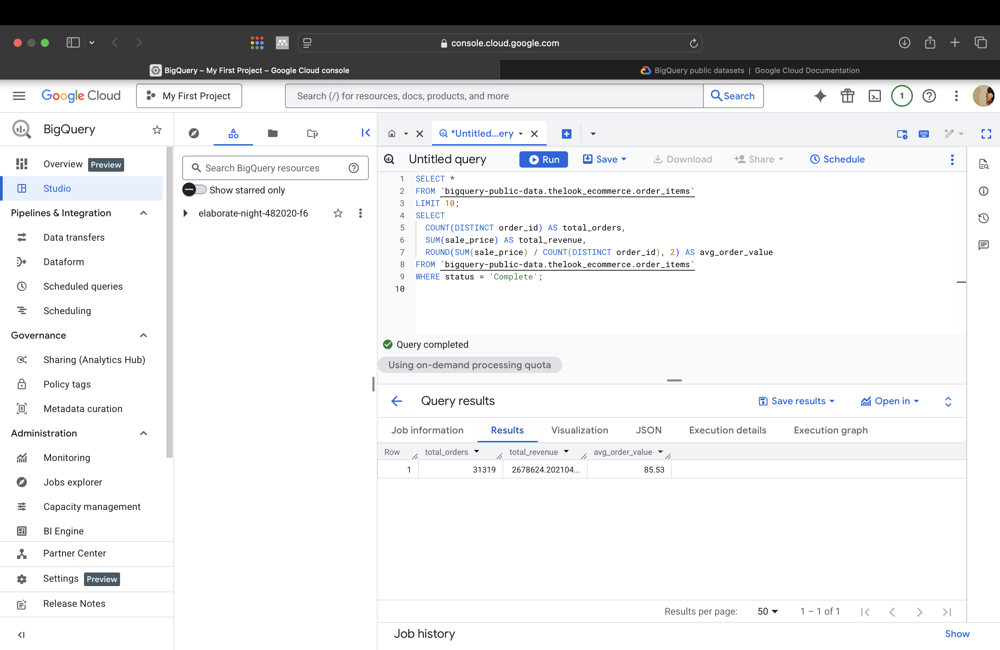
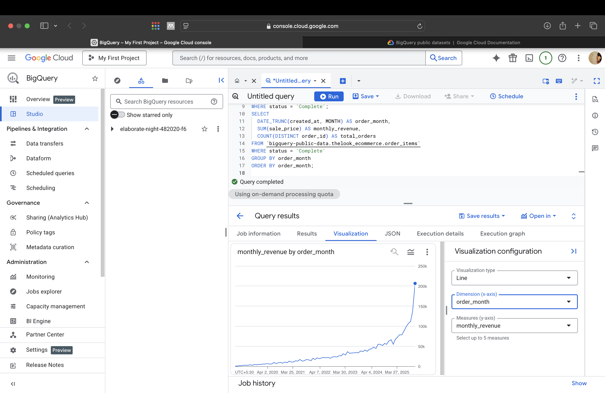
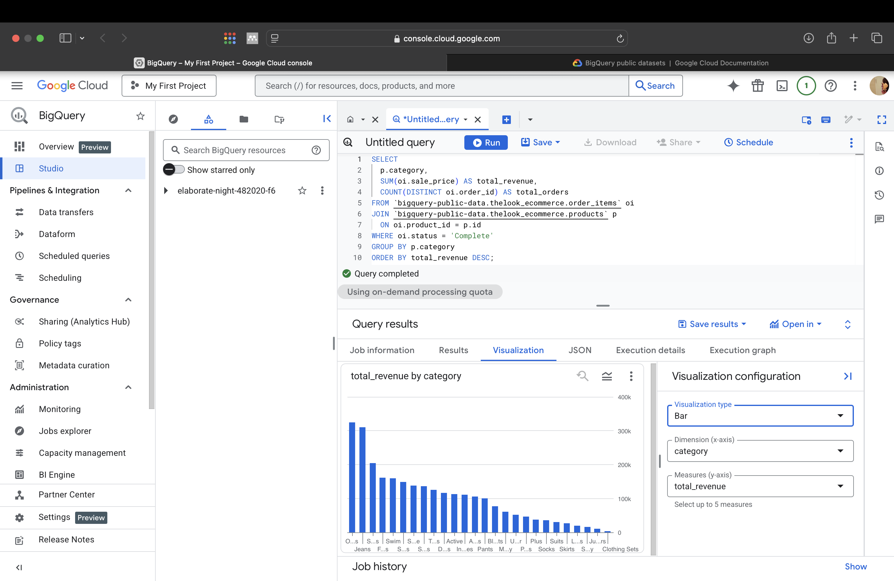
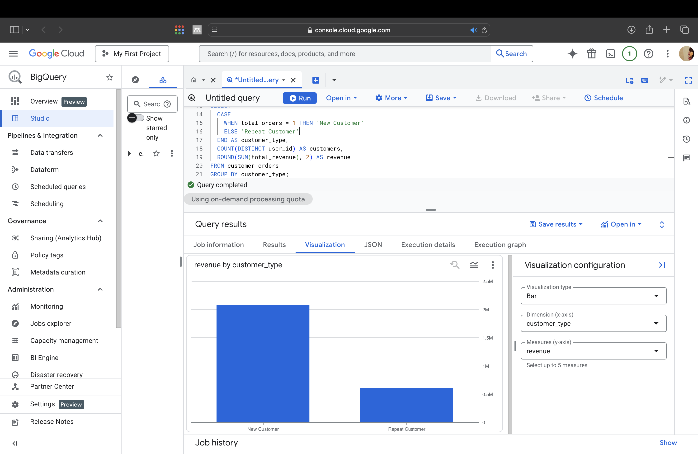
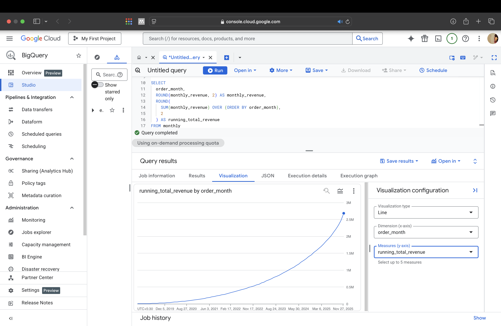

# SQL Sales Analysis – BigQuery E-Commerce Dataset

## 📊 Project Overview
This project analyzes sales performance using Google BigQuery’s public e-commerce dataset.
The goal is to extract actionable business insights related to revenue growth, customer behavior,
and product performance using SQL.

This project demonstrates:
- Writing analytical SQL queries
- Aggregating business KPIs
- Time-series analysis
- Customer segmentation
- Presenting insights clearly for stakeholders

## 🧰 Tools & Technologies
- Google BigQuery
- SQL
- Public E-commerce Dataset (`thelook_ecommerce`)
- GitHub (documentation & version control)

## 📈 Key Business Questions & Insights

### 1️⃣ Overall Sales KPIs
**Question:** What are the total orders, revenue, and average order value?

**Insight:** Provides a high-level snapshot of business performance for leadership reporting.

### 2️⃣ Monthly Revenue Trend
**Question:** How has revenue changed over time?

**Insight:** Identifies growth trends and seasonality patterns in sales.

### 3️⃣ Revenue by Product Category
**Question:** Which product categories generate the most revenue?

**Insight:** Helps prioritize high-performing categories for inventory and marketing decisions.

### 4️⃣ Top 10 Customers by Spend
**Question:** Who are the highest-value customers?

**Insight:** Useful for loyalty programs and targeted retention strategies.

### 5️⃣ New vs Repeat Customers
**Question:** How does revenue differ between new and repeat customers?

**Insight:** Shows the importance of repeat customers to total revenue.

### 6️⃣ Running Total Revenue
**Question:** How does cumulative revenue grow over time?

**Insight:** Demonstrates long-term revenue growth and business scaling.

## Aurthor 
Anam Althaf

Aspiring Junior Data Analyst
